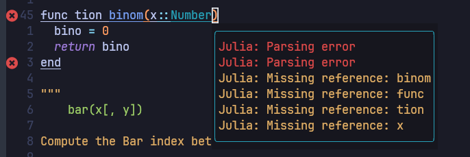
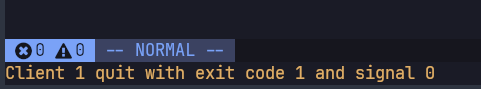

# Setup Julia Repo in GitHub with Actions

## Install Julia

Basically if you are using Linux or Mac, you can easily install Julia by the package manager.
For Gentoo, we can install it with portage as following.

```shell
$ sudo emerge -av julia

```

The problem to install Julia by [Gentoo package manager](https://wiki.gentoo.org/wiki/Portage)
is slow upgrade speed.
In this time, July 27 2023, latest stable version version of Julia in the
[official site](https://julialang.org/downloads/) is 1.9.2 but Gentoo still has
1.8.5 as the latest one.
To overcome this gap, according to the instruction in [Julia GitHub](https://github.com/JuliaLang/julia)
we can easily install it by compiling source.

```shell
$ cd localgit  <-- local git directory
$ git clone https://github.com/JuliaLang/julia.git
$ cd julia
$ git checkout v1.9.2  <-- tag for latest version
$ make
$ ln -s julia ~/.local/bin/julia  <-- This should be earlier path than /usr/bin/julia
```

## Setup Julia language server for Neovim

!!! note

    This setup is based on cloned
    [Neovim-from-scratch](https://github.com/erdosxx/Neovim-from-scratch/tree/27_Julia_REPL)
    and [Github repo: evoagile_configs](https://github.com/erdosxx/evoagile_configs) repo.

To setup LSP([Language Server Protocol](https://microsoft.github.io/language-server-protocol/)) with
[julials.lua](https://github.com/erdosxx/Neovim-from-scratch/blob/27_Julia_REPL/lua/user/lsp/settings/julials.lua)
file in [Neovim-from-scratch](https://github.com/erdosxx/Neovim-from-scratch/tree/27_Julia_REPL),
we need to setup `nvim-lspconfig` environment first.
Using [stow](https://packages.gentoo.org/packages/app-admin/stow) tool,
we can copy `Makefile` to `~/.julia/environments/nvim-lspconfig/`.

```shell
$ cd localgit/evoagile_configs   <-- if your local cloned repo is in localgit
$ stow -t ~ julia
$ cd ~/.julia/environments/nvim-lspconfig/
$ make
```

After `make` command, `neovim` is launched and open `Example.jl` source file with
some errors. If you wait a moment and no problem occur to install, you can find
some bullets as following screenshot.


Then just quit `neovim` and continue and finish installation.
To test installation, open any exmaple julia file and change keyword `function` to
`func tion` and at the same line, input `gl`. If you have some bullets and
messages as following, your installation is successful.


If you have any error to load Julia LSP, you can find following errror message in `neovim`.


## Setup Julia Formatter for Neovim

### Setup Julia Language server in NeoVim

## Use [PkgTemplates](https://github.com/JuliaCI/PkgTemplates.jl) to generate repository

## Use [GitHub-CLI](https://cli.github.com/) to create repository in GitHub

## References

1. [Github repo: evoagile_configs](https://github.com/erdosxx/evoagile_configs)
2. [Github repo: Neovim-from-scratch/27-Julia-REPL](https://github.com/erdosxx/Neovim-from-scratch/tree/27_Julia_REPL)
3. [Setting up Julia lsp for Neovim](https://www.juliabloggers.com/setting-up-julia-lsp-for-neovim/)
4. [discourse: Neovim + LanguageServer.jl](https://discourse.julialang.org/t/neovim-languageserver-jl/37286/63?page=5)
